# ⚕️ MediTrack 

**Smart Medicine Stock Manager**

---

## 🎓 Motivation Behind Developing This Application  

Running a medical shop is not easy. Shopkeepers must track expiry dates, sales, and stock. Doing this by hand takes time and can cause mistakes, losses, or expired medicines. **MediTrack** helps by giving a digital solution to manage everything easily.  

---

## ❓ Why MediTrack?

Normal inventory apps are made for general use. But MediTrack is made only for medical shops. It gives special features like:

- **Expiry Alerts**: Reminds you when medicines are about to expire. 
- **Sales Tracking**: Stock updates automatically when you sell a medicine.
- **Reports & Analytics**: See which medicines sell fast, stock value, and trends. 
- **Data Safety**: All data is saved locally in SQLite, safe and offline.

---

## 🛠 Built With  

MediTrack is a cross-platform app, so it works on mobile, web, and desktop.

Technologies used in this project:  

- [Flutter](https://flutter.dev/) (Dart)  
- [Provider](https://pub.dev/packages/get) (State Management)  
- [SQLite](https://www.sqlite.org/) (Database Integration)
- [Figma](https://www.figma.com/) (Design)  
- Material Design  
- Fl_chart-Charts & Analytics  

---

## ⭐ Features  

- 💊 **Add Medicines**: Save details like name, batch no., expiry, price, and stock. 
- 📟 **Dashboard**: Shows total stock value, sales, and expiring medicines.
- 📝 **Record Sales**: Easy billing, stock updates automatically.   
- 🎯 **Expiry Management**: Alerts for soon-to-expire medicines.
- 📊 **Sales Reports**: Daily/weekly/monthly sales and profit reports.
- 🗓  **Search & Filter**: Quickly find medicines by name, expiry, or stock.
 
---

## ⬇️ Download

You can download the most recent version of StuBuddy at [MediTrack.app/download](https://drive.google.com/file/d/1raza-IKWBuDR7rZXbksDtwlJq7gcuXCy/view?usp=drivesdk)

---

## 📸 Screenshots  

### Create Account 

  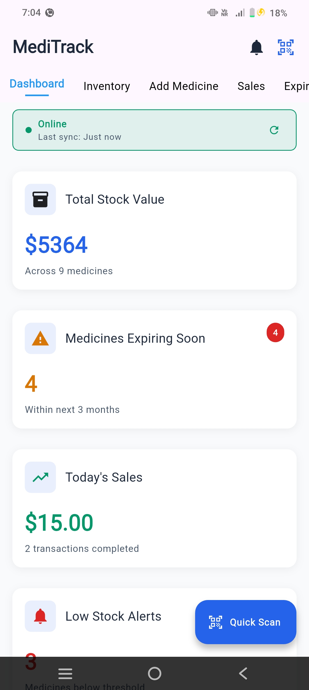
  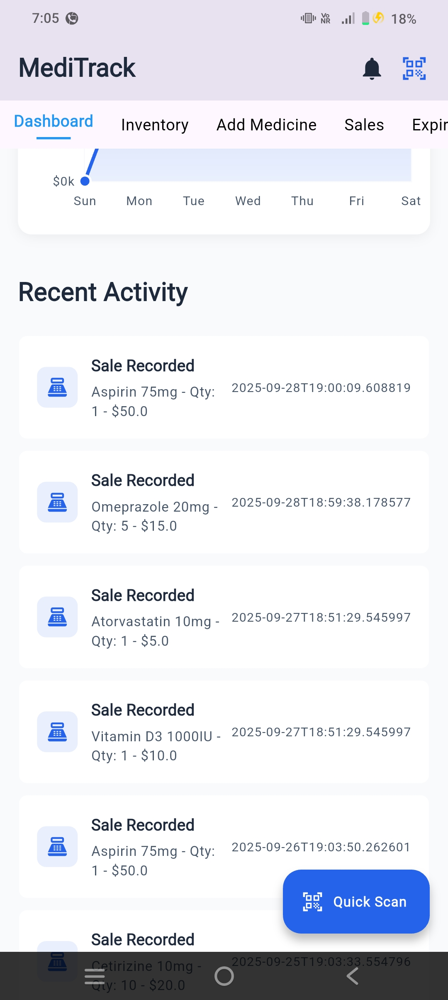
  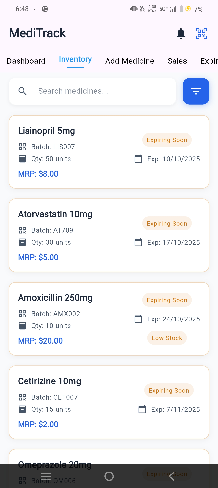

 

### Home Screen 

  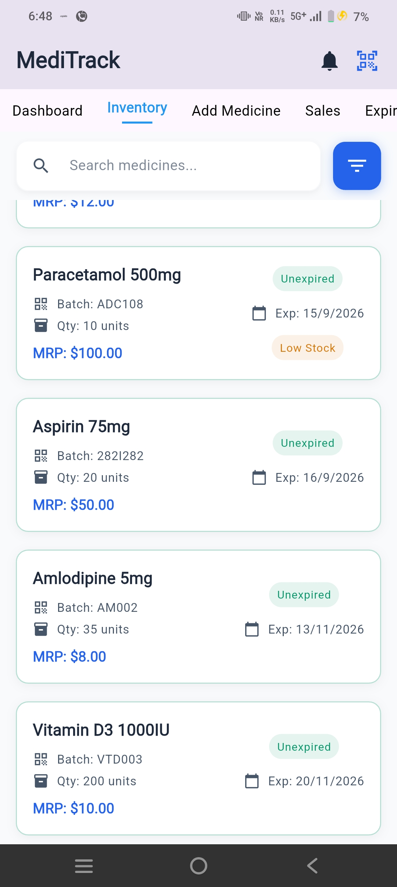

 

### Timetable Screen  

  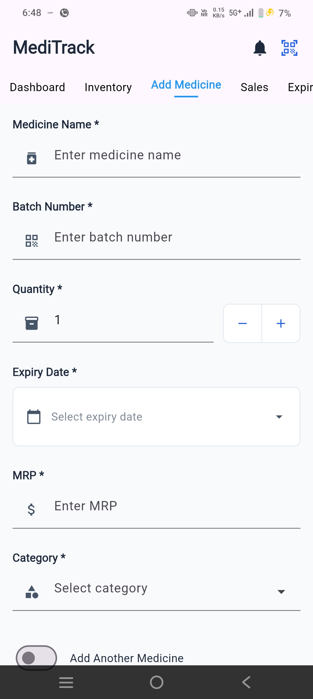
  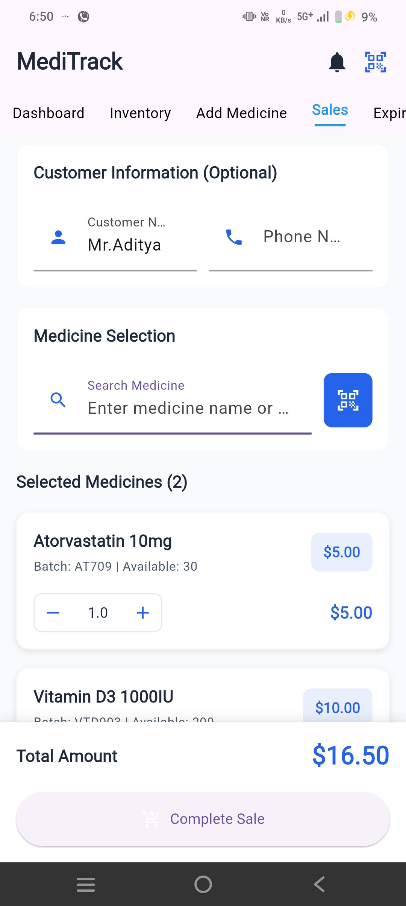

 

  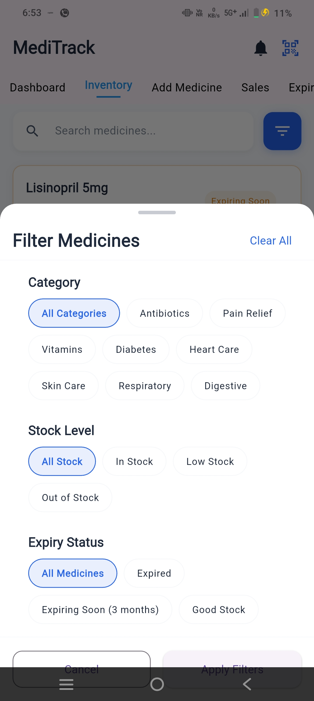
  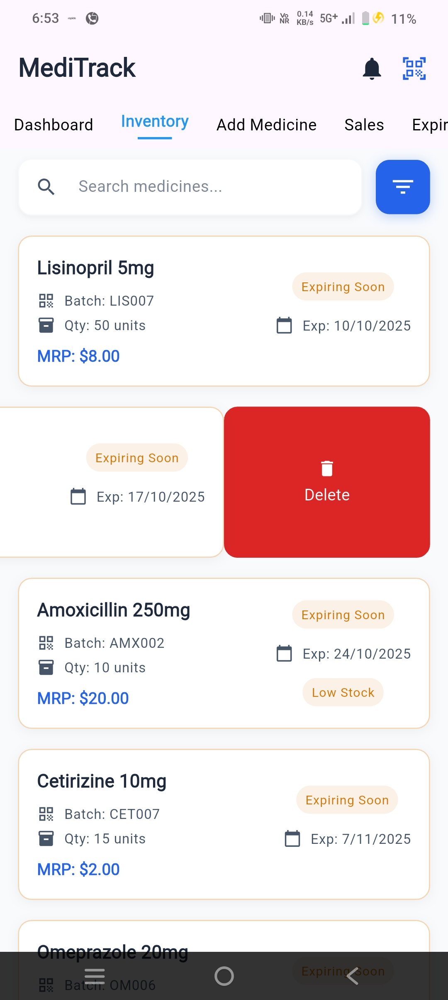

 

### ToDo List

  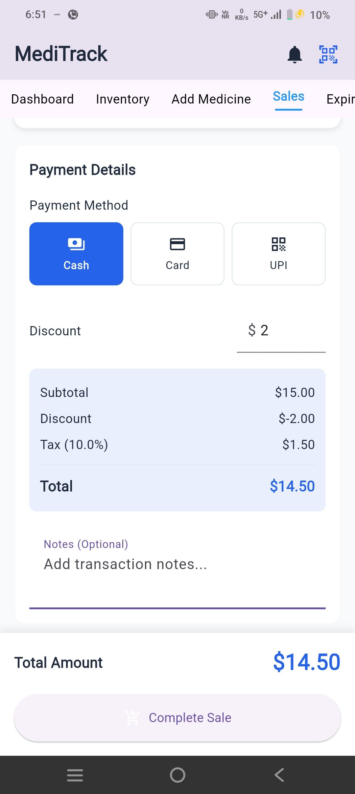
  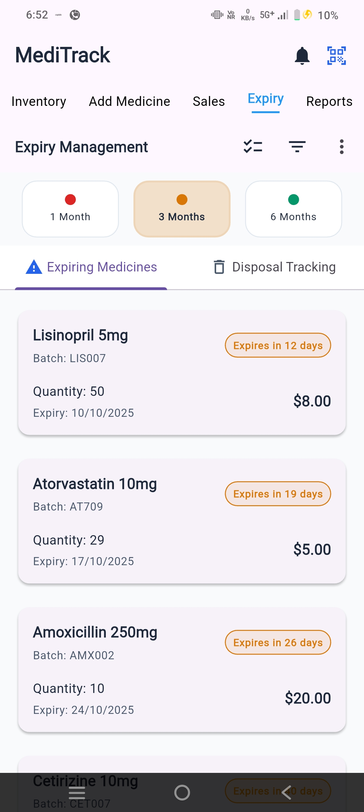
  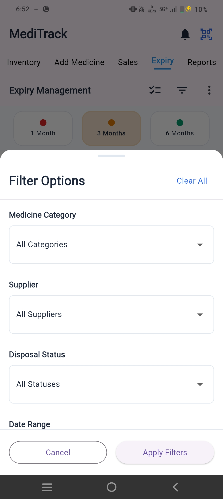

 

  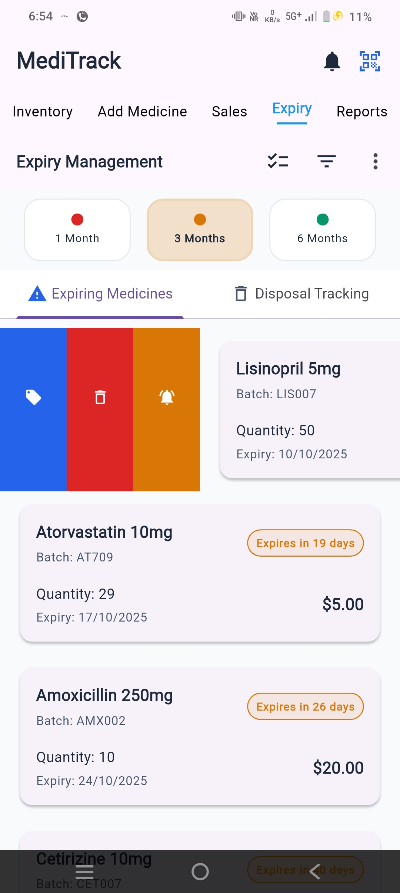
  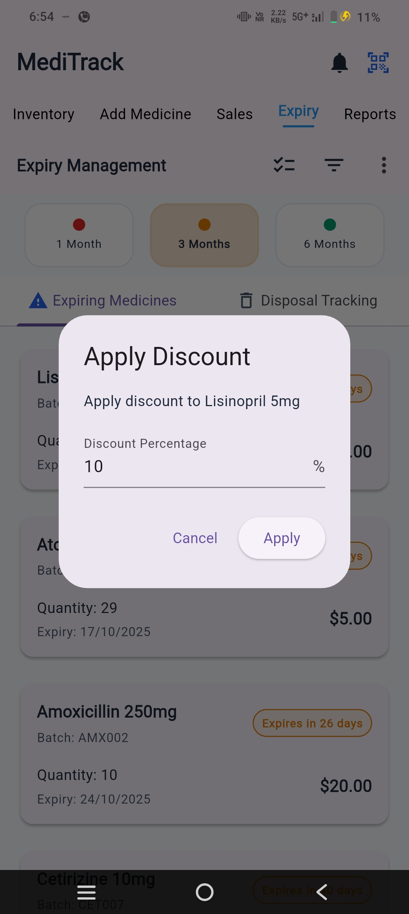

 

### Attendance Tracking   

  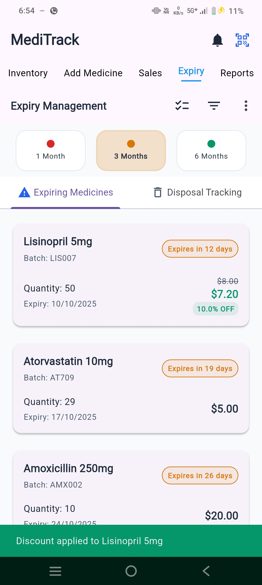
  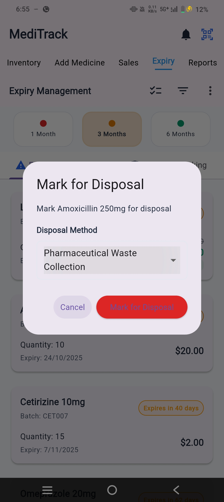
  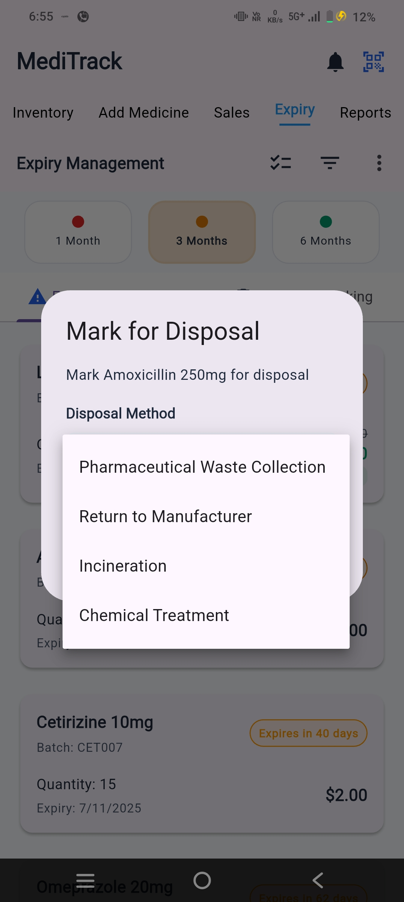

 

### Split Bill  

  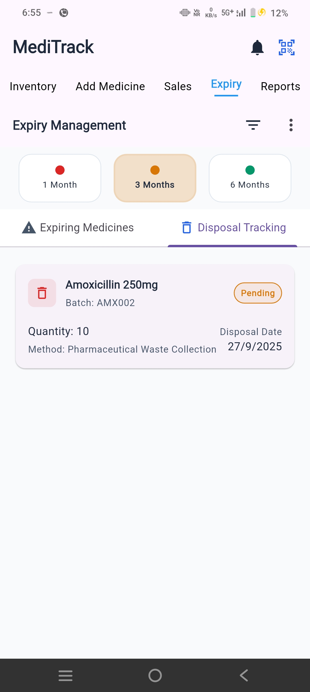
  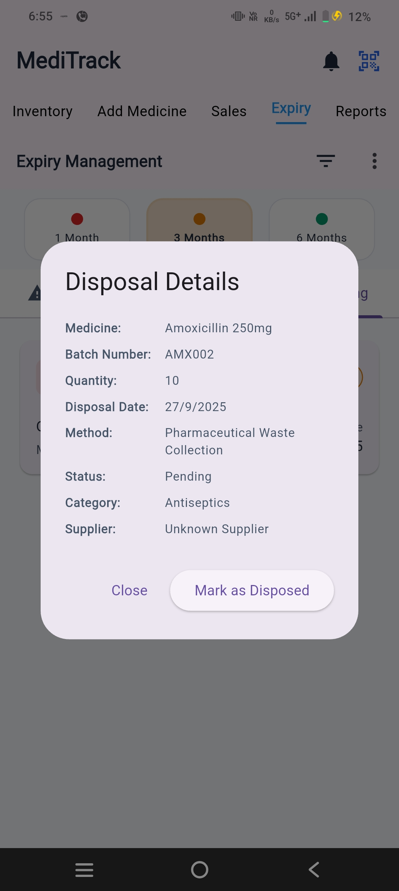
  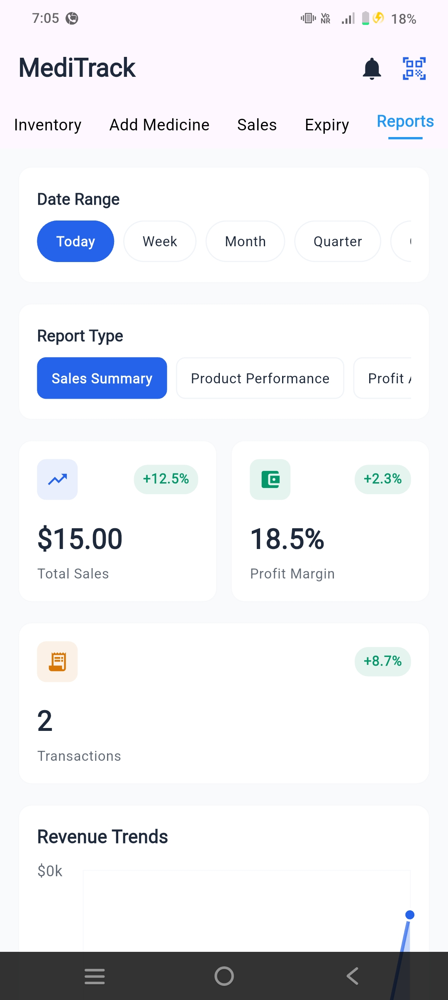

 
  
### Calendar & Events  

  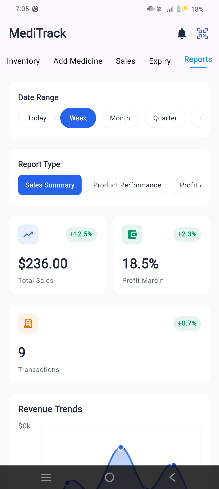
  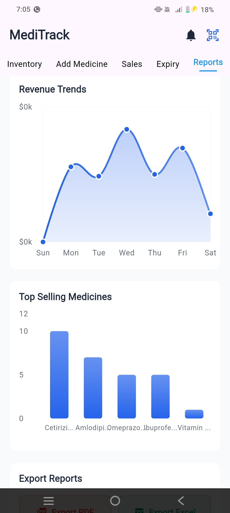

 

### MyGrades

  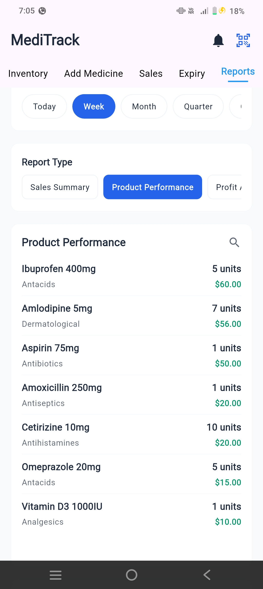
  
  

 

### Profile

  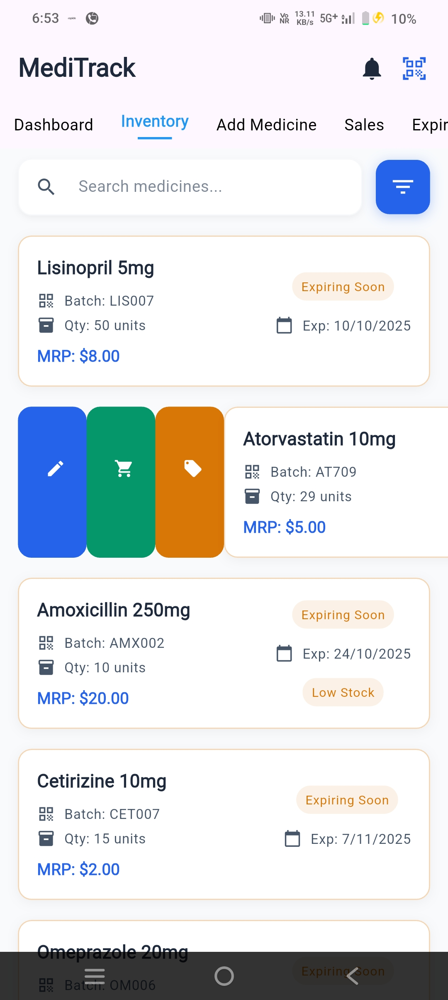
  

 

---

